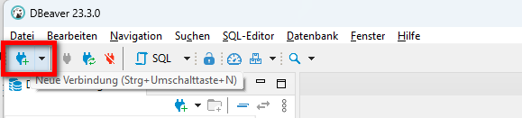
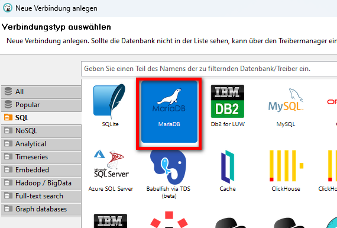
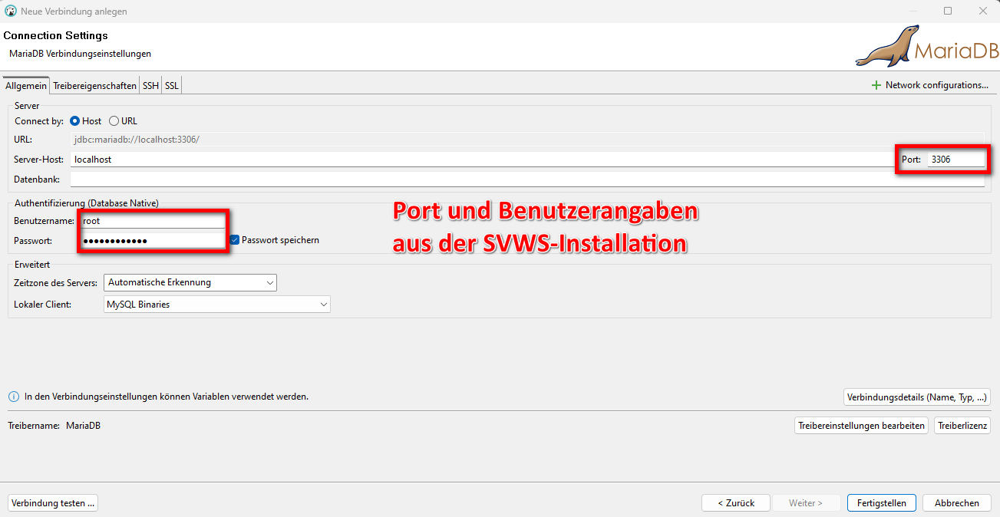
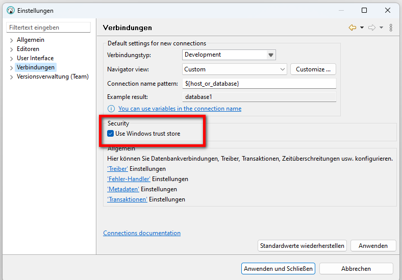

# Öffnen der Datenbanken mit DBeaver

### Installation von DBeaver
Installieren Sie DBeaver, sofern das Programm noch nicht auf Ihrem Rechner installiert ist:
https://dbeaver.io/download/

Öffnen Sie das Programm anschließend.

### Datenbankverbindung öffnen:
1. Wählen Sie **Neue Verbindung anlegen** aus.       
 

2. Wählen Sie als Datenbank **MariaDB** aus.   

3. Geben Sie **Port und Benutzerangaben** an. Diese Angaben wurden bei der SVWS-Serverinstallation festgelegt.   

4. Über die linke Leiste können einen Tabellen ausgewählt und gesichtet werden:   

> [!TIP] 
> Bei Problemen sollte man diese Einstellung einmal überprüfen:
> 
