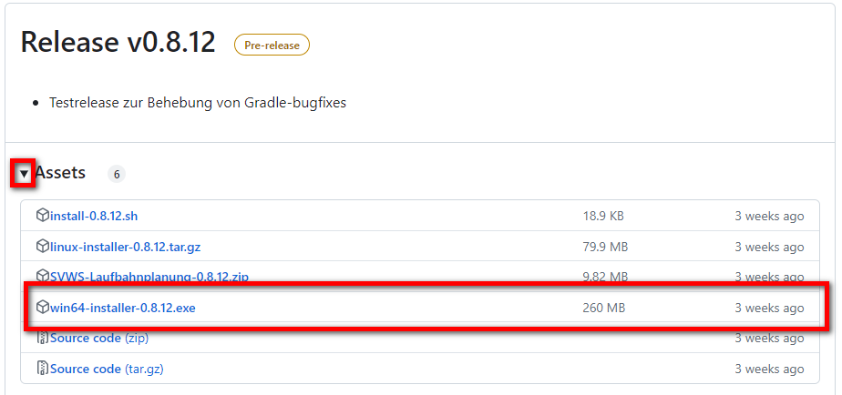
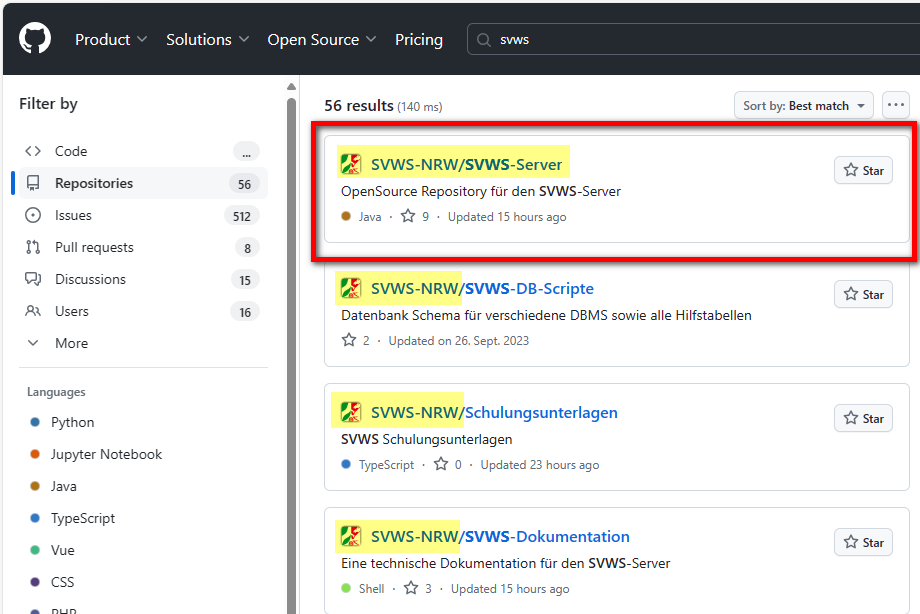

# Installation vom SVWS-Server

### Aufgabe: Download der Installationsdateien
Laden Sie sich im SVWS-NRW-Repository die notwendigen Installationspakete herunter.  

Die aktuellen Installationsdateien vom SVWS-Server befinden sich im GitHub: 
https://github.com/SVWS-NRW/SVWS-Server/releases

Auch ohne diesen Link, findet man die Downloadseite auf der Homepage von GitHub. Unter www.github.com kann man ohne Benutzerkonto nach SVWS suchen:

Nach Auswahl des Repositorys SVWS-NRW/SVWS-Server kommt man über Releases auf die Downloadseite:

> [!TIP] 
> Hier findet man noch viele andere öffentliche Reporitorys von SVWS-NRW. Man erkennt diese direkt an dem NRW-Wappen Icon.

### Aufgabe: Installation Starten
Führen Sie die Installation als Administrator aus!

> [!TIP] 
> Eine gute Anleitung finden Sie auch im Wiki: 
> https://schulverwaltungsinfos.nrw.de/svws/wiki/index.php?title=Installation_SVWS-Server_und_SchILD-NRW_3#Installation_des_SVWS-Servers

