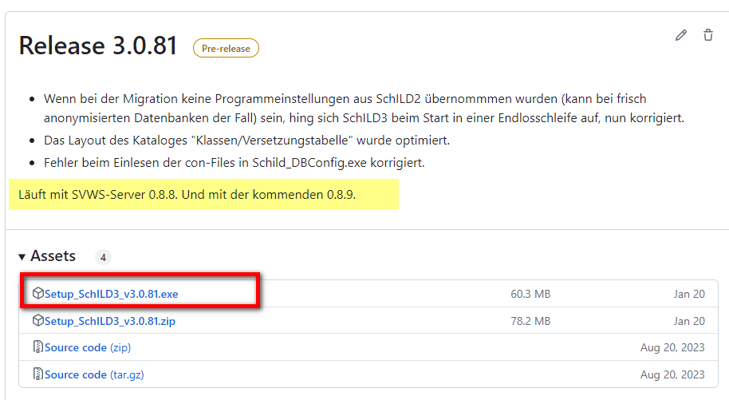
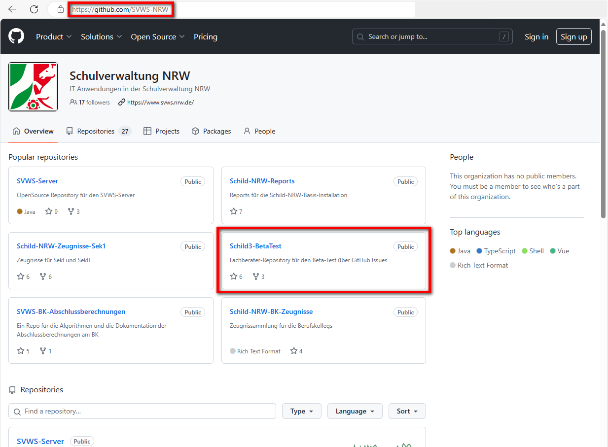

# Installation von SchILD-NRW3
### Aufgabe: Download der Installationsdateien
Laden Sie sich im SchILD-NRW-Repository die notwendigen Installationspakete herunter.  

Die aktuellen Installationsdateien von SchILD-NRW3 befinden sich im GitHub: 
https://github.com/SVWS-NRW/Schild3-BetaTest/releases

Auch ohne diesen Link, findet man die Downloadseite auf der Homepage von GitHub. Unter www.github.com/SVWS-NRW:

Nach Auswahl des Repositorys SVWS-NRW/SVWS-Server kommt man über Releases auf die Downloadseite:

### Aufgabe: Installation Starten
Führen Sie die Installation als Administrator aus!

> [!TIP] 
> Eine ausführliche Anleitung finden Sie auch im Wiki: 
> https://schulverwaltungsinfos.nrw.de/svws/wiki/index.php?title=Installation_SVWS-Server_und_SchILD-NRW_3#Installation_von_SchILD-NRW_3 

Nach der Installation öffnet sich automatisch das Programm '''SchILD_DBConfig.exe''' aus dem Ordner C:\Program Files (x86)\SchILD-NRW3. Mit diesem Programm kann die Verbindungsdatei xyz.con erstellt und gespeichert werden. Bei weiteren Migrationen muss dieses Programm manuell gestartet werden, um entsprechende Verbindungsdateien zu den weiteren Datenbanken zu erstellen.

> [!TIP] 
> Eine gute Anleitung finden Sie auch im Wiki: 
> https://schulverwaltungsinfos.nrw.de/svws/wiki/index.php?title=Installation_SVWS-Server_und_SchILD-NRW_3#Die_Konfigurationsdatei_.28auch_mit_SchILD_DBConfig.exe.29

