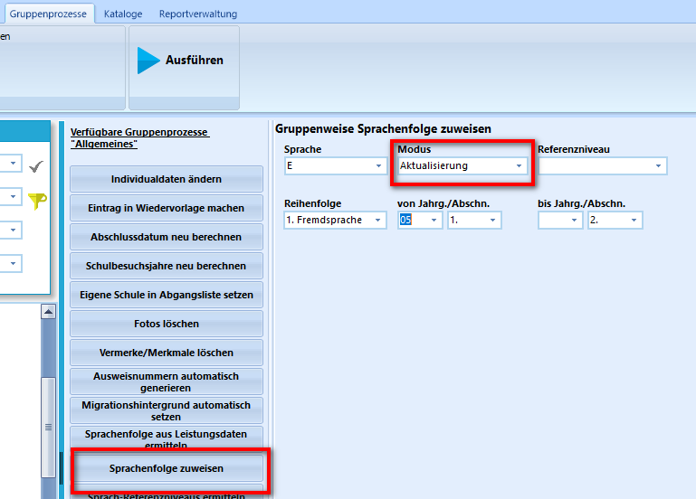

# Import von SchILD2-Laufbahndaten

Für diesen Aufgabenblock finden Sie im Ordner Import_LUPO_KURS eine SQLite-Spieldatenbank mit zugehörigen .lup und .blo-Dateien.

## Download der benötigten Dateien
Speichern Sie alle Beispiel-Dateien aus dem Ordner Import_LUPO_KURS. 

## Import der Spieldatenbank
Importieren Sie die SQLite Datenbank über das Admin-Tool im Client. Da einige Features derzeit noch nicht über den Client realisiert werden können (beispielsweise Gruppenprozesse), ist es hilfreich, eine Verbidungsdatei von SchILD-NRW3 zur Datenbank zu erstellen. Nutzen Sie dazu das Program migrate.db.    
Kontrollieren Sie anschließend im Client, 
+ ob in der Datenbank noch kein Abiturjahrgang angelegt ist und
+ ob bei den SchülerInnen noch keine Laufbahnplanung hinterlegt ist.

> [!NOTE]
> Es wird empfohlen, den Import über den Client-Admin auszuführen.  
> Rufen Sie dazu über den Brower die Seite *https://localhost/admin* auf.  
> Über "Backup wiederherstellen: SQLite-Schema importieren" kann die entsprechende Datenbank ausgewählt werden.

## Import der Fachwahlen
Importieren Sie die Fachwahlen der EF, Q1 und Q2. (.lup-Dateien)   

## Englischwahl korrigieren
Aufgrund von Altlasten aus der SchILD2-DB kann es zu Fehlern in der Laufbahnplanung kommen.    

In der vorliegenden Datenbank wurde neben dem Kürzel E auch E5 in der Oberstufe gepflegt:

Korrigieren Sie diesen Fehler.
> [!NOTE]
> Kataloge --> Fächer

Nachdem E5 nun nicht mehr im Fächerkatalog der Oberstufe erscheint, ist das Fach E nach wie vor ausgegraut. Betrachtet man eine Laufbahnplanung eines Schülers, ist folgender Fehlercode ersichtlich:   
**Eine fortgeführte Fremdsprache wurde in der Sprachenfolge als neu einsetzend eingetragen. Die Sprachenfolge ist fehlerhaft.**

Korrigieren Sie diesen Fehler. Da aktuell noch keine Gruppenprozesse über den SVWS-Client implementiert sind, kann dies mit SchILD-NRW3 schnell korrigiert werden.

## Import einer Kurs42 Blockung
Bevor eine alte Kurs42-Blockung im SVWS-Client importiert werden kann, müssen die dazu notwendigen Text-Dateien aus Kurs42 heraus exportiert und gezippt werden. Details dazu sind im SVWS-Client im Reiter Schule/Datenaustausch/Kurs42-Blockungen beschrieben.   
1. Öffnen Sie die Blockung für die EF _EF_2023_24.2.blo und erstellen Sie einen zip-Ordner 
2. Importieren Sie die Blockung im SVWS-Client und sichten Sie diese im Abiturjahrgang der EF.
3. Optional: Erstellen Sie mit dem Client eine weitere Blockung und vergleichen Sie die Ergebisse

## Import für die Q1
1. Importieren Sie die Kurswahlen für die Q1
2. Lösen Sie Konflikte
3. Importiern Sie die Kursblockung der Q1
4. Schreiben Sie die Kursblockung hoch
5. Löschen Sie leere Kurse
6. Legen Sie Zusatzkurse an

> [!NOTE]
> **Für den Optimalfall (kein Schüler muss einen bestehenden Kurs wechseln)**  
> Alle Kurse außer den Zusatzkursen links mit einer Checkbox auswählen (=Erst alle auswählen und Zusatzkurse dann abwählen)    
> die Fixierungsoptionen oben nutzen und damit Kurse und Schüler fixieren (dauert etwas)   
> Anschließend bei den Zusatzkursen evtl. Schienen sperren, in die sie nicht sollen.    
> Jetzt blocken.

