# Report-Schulung zu SchILD

## Vorbemerkungen

Diese Schulungsunterlagen begleiten die Schulung zum Umgang mit dem Formularexplorer. Es wird beschrieben, wie man fremde Reports einbinden kann, vor allem aber, wie man eigene Reports von der Pike auf erstellen kann.

Am ersten Tag wird eine Lehrerliste erstellt, bei der alle grundlegenden Techniken und die wichtigsten Formatierung erläuternt werden. Am zweiten Tag werden Schülerliste erstellt und auf deren Besonderheiten eingegangen.

## Allgemeine Hilfe

Wie immer gibt es Hilfen im Netz für den Umgang mit SchILD. Hier sind die wichtigsten:

* [https://svws.nrw.de], die Hauptseite für alles, was mit SchILD zu tun hat
* [https://wiki.svws.nrw.de/mediawiki/index.php?title=Hauptseite], die Hilfeseiten mit Wiki
* [https://www.schulministerium.nrw.de/BiPo/fbsuche/fbsuche.xhtml] Fachberatersuche

## Reports

Gehen Sie auf der Website "Schulverwaltung NRW - IT-Anwendungen" (svws.nrw.de) auf DOWNLOAD - SchILD-NRW - SchILD-Reports - Einzelreports - Alle Schulformen, laden Sie den Report "masernimpfnachweise.rtm" herunter und entpacken/extrahieren Sie diesen im Ordner "downloads".
Öffnen Sie über Druckausgabe den Report-Explorer und legen Sie unter dem Ordner "SchILD-Reports" ein Unterverzeichnis mit beliebigem Namen an. Ziehen Sie jetzt per drag & drop die beiden heruntergeladenen rtm-Dateien in das rechte weiße Feld.

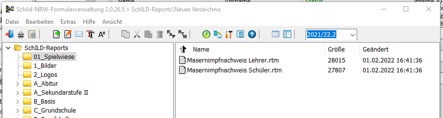

Alternativ können Sie die beiden rtm-Dateien kopieren und unter C:\Users\…\Downloads\ SchILDNRW_Install\SchILDNRW_Install\Schild-Programm\SchILD-Reports ablegen. Dieses Vorgehen ist im Schulbetrieb nur bei lokaler Installation oder Serverinstallation möglich, falls Sie die entsprechenden Zugriffsrechte besitzen. Der Dateipfad lautet dann in der Regel C:\SchILDNRW\SchILD-Reports.

## Schnellzugriff einrichten

Gehen Sie unter Extras - Programm-Einstellungen auf den Reiter Globale Einstellungen - Report-Einstellungen - Schnellzugriff und aktivieren Sie "Schnellzugriff ermöglichen". Klicken Sie jeweils auf den gelben Ordner und weisen Sie aus dem Verzeichnis "C:\Users\…\Downloads\SchILDNRW_Install\ SchILDNRW_Install\Schild-Programm\SchILD-Reports" zwei bis drei Reports Ihrer Wahl zu und wählen Sie eine Schalterbeschriftung.

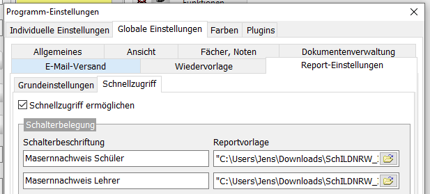

Es erscheint nun sofort und bei jedem Start des Programmes der Report-Schnellzugriff. Sie können nun eine Ihrer erstellten Reportverbindungen anklicken und den Report drucken. Sollten Sie im Container alle Schüler ausgewählt haben ist natürlich die "Ausgabe für … die ganze Gruppe" nicht zu empfehlen. Schauen Sie sich also lieber nur die Vorschau an.
Oben rechts können Sie den Report-Schnellzugriff schließen und jederzeit mit einem Klick auf "Drucken" wieder öffnen.

## Dokumentenverwaltung einrichten

Gehen Sie unter Extras - Programm-Einstellungen auf den Reiter Globale Einstellungen - Dokumentenverwaltung und aktivieren Sie die Dokumentenverwaltung. Klicken Sie nun unter "Dokumentenverzeichnis" auf den gelben Ordner und legen einen für Sie passen Pfad fest. Da voreingestellt für alle Schüler der Testdatenbank auf Ihrem Rechner unter C:\ ein Verzeichnis angelegt wird, bietet es sich an, einen Ordner "Dokumentenverwaltung" in unserem Testprogrammordner anzulegen. Den können Sie später auch einfach wieder löschen.

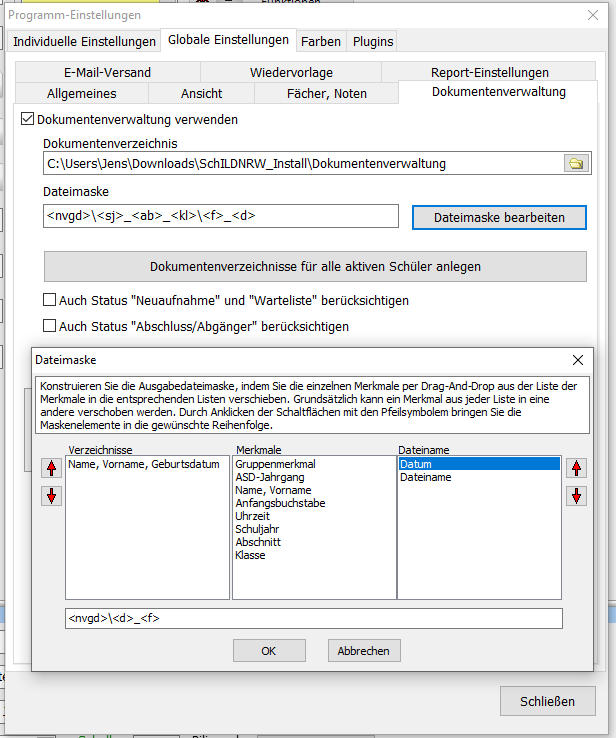

Klicken Sie nun auf "Dateimaske bearbeiten" und legen Sie per drag & drop die für Sie passende Verzeichnis- und Dateistruktur der Dokumentenverwaltung an. Alle Merkmale, die Sie nicht benötigen ziehen Sie hierfür in das Kästchen "Merkmale". Zur Festlegung der Reihenfolge benutzen Sie die roten Pfeiltasten. Bestätigen Sie mit "OK", klicken Sie auf "Dokumentenverzeichnisse für alle aktiven Schüler anlegen" und schließen Sie die Programmeinstellungen.
Nun sollte der Reiter oben rechts "Dokumentenverwaltung" lauten und Sie können einen beliebigen Report in das Dokumentenverzeichnis eines Schülers mit der Einstellung "Ausgabe … nur Archivierung (in Dokumentenverwaltung)"  "Ausgabe für … den ausgewählten Schüler" drucken, der dort als pdf-Datei hinterlegt wird.

## Oberfläche des Reportdesigners

### Benutzeroberfläche der Reportauswahl

Es folgt eine Übersicht der wichtigsten Bedienelemente des Reportexplorers.

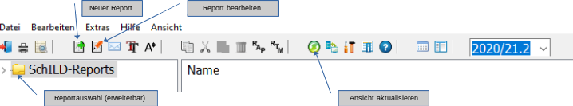

### Die Oberfläche des Reportdesigners

Hier sind die wichtigsten Bedienelemente des Reportdesigners aufgelistet:

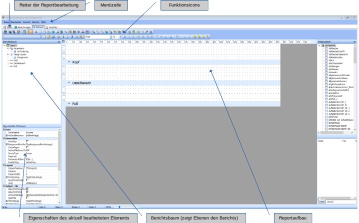

Hier finden Sie die wichtigsten Icons:

| Icon | Bedeutung|
| ----- | -----|
|  | Label (einifaches Textfeld) hinzufügen |
| 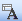 | DBText (Datenbankfeld) hinzufügen |
| 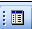 | Dynamisch ladbaren Subreport, z. B. Köpfe und Füße, die von mehreren Berichten genutzt werden, hinzufügen. Das Icon befindet sich weit links, bitte nicht mit Subreport verwechseln. |
|  | Subreport zum Zugriff auf eine untergeordnete Datenquelle hinzufügen. Das Icon befindet sich weit rechts, bitte nicht mit dynamsich ladbaren Subreports verwechseln. |
|  | längeren formtierbaren Text (RichText) hinzufügen |
| 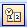 | Systemvariable hinzufügen |
|  | Variable hinzufügen |
|  | DBText (Datenbankfeld) hinzufügen |
|  | Graphik hinzufügen |
| 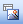 | in der Datenbank hinterlegte Graphik hinzufügen |
|  | Formen hinzufügen |
| 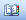 | Seiteneinstellungen ändern |

## Erstellung von Listen

### Ziel

Wir wollen von der Pike auf eine Liste mit Daten über das Lehrerkollegium erstellen. Das Ergebnis soll in etwa so aussehen:

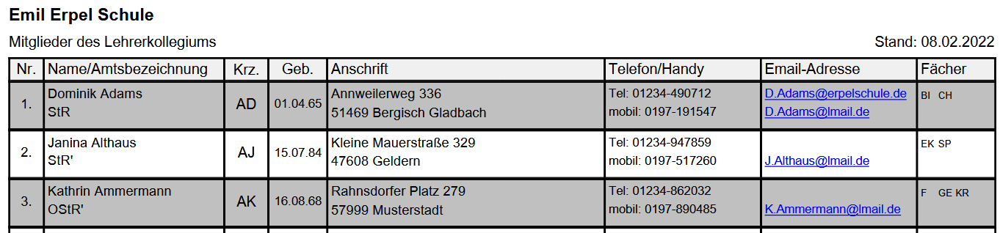

### Allgemeines und Vorarbeit

Die Kopfbereich wird einmal pro Seite ausgegeben, der Fußbereich ebenso. Der Detailbereich wird für jeden Datensatz wiederholt, bis alle Daten angezeigt wurden. Die Elemente der Liste müssen also in den Detailbereich.

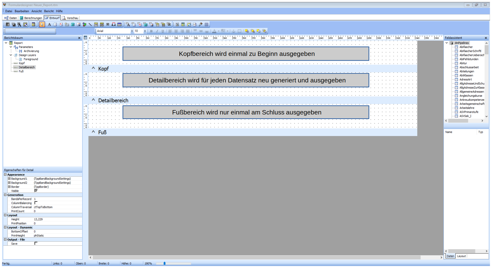

Die Elemente der Liste müssen also in den Detailbereich, da hier alle Datensätze "abgearbeitet" werden. Je nachdem, was für eine Liste ausgegeben werden soll, muss die Datenquelle angepasst werden. Klicken Sie auf "Bericht" im oberen Menü, dann "Datenquellen" und das passende auswählen. Da SchILD ein schülerzentriertes Programm ist, ist  die Standarddatenquelle "Schueler".

Da wir eine Lehrerliste erstellen wollen, müssen wir logischerweise die Datenquelle "Lehrer" auswählen.

### Kopfzeile und Fußzeile beschriften

Wählen Sie ein DBTextfeld (A-Symbol mit Tabelle im Hintergrund) und klicken in den Kopfbereich des Dokuments. Ziehen Sie das Label möglichst zentriert. Klicken Sie das Feld an und wählen in den beiden Drop-down-menus am linken oberen Rand die Datenquelle "EigeneSchule" und das Datenfeld "Bezeichnung1".

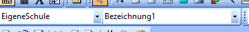

Setzen Sie darunter ein Label(A-Symbol ohne Tabelle im Hintergrund) und klicken Sie unterhalb des DBText-Feldes in den Kopfbereich. Geben Sie in den Bereich oben links "Lehrerliste" ein.

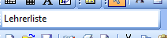

In der Fußzeile geben wir den Stand der Liste an. Erstellen Sie im Fußbereich ein Label und schreiben darin "Stand:". Wählen Sie das Symbol Systemvariable und klicken auch in den Fußbereich. Das Datum ist hier die Standardeinstellung. Ziehen Sie dieses neben das Label.

### Hoch- und Querformat in Reports

Die geplante Lehrerliste hat die Spalten Nummer, Name und Vorname, Geburtsdatum, Anschrift, Telefonnummern, E-Mail und Unterrichtsfächer. Demnach müssen sieben Spalten eingerichtet werden, wodurch sich das Querformat anbietet. Gehen Sie im Menü auf Datei - Seite einrichten - Papiergröße und wählen Sie Querformat.

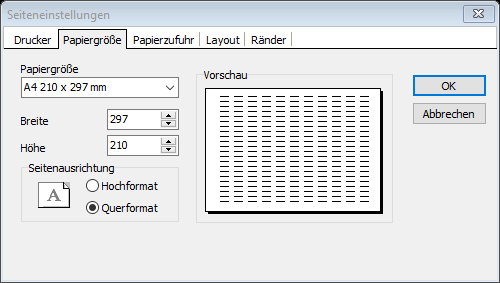

### Tabellen anlegen (TableGrid)

Zum Erstellen einer Tabellenstruktur verwenden wir ein sog. TableGrid.

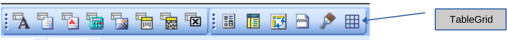

Ziehen Sie zunächst den Detailbereich größer und klicken Sie dann auf das Grid-Symbol und dann in den Detailbereich. Klicken Sie in die untere Zeile mit der rechten Maustaste und wählen Sie Row - Select. Danach erneut Rechtsklick und Row - Delete. Sie haben nun nur noch eine Zeile mit drei Kästchen. Hinzufügen weiterer Tabellenspalten: Klicken Sie mit der rechten Maustaste in ein Kästchen und wählen Column - Add. Wiederholen Sie dies in der gewünschten Anzahl der Spalten.

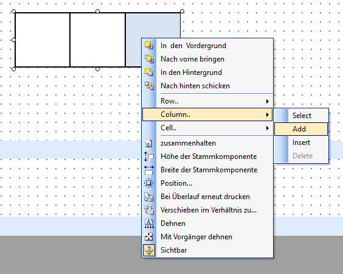

Klicken Sie anschließend im Berichtsbaum auf das TableGrid1 und geben Sie bei den Eigenschaften für Left und Top den Wert 0 und üfr Height den Wert 13 ein.

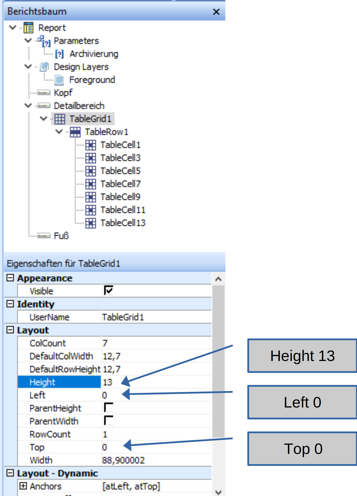

Wählen Sie dann mit der rechten Maustaste eine Zelle aus und wählen Column - Select und wählen die Spaltenbreite. (hier für den Zähler 10, ansonsten beliebig) und verfahren analog mit den anderen Spalten.  
Legen Sie nun eine weiteres Grid genauso an und legen es in den Kopfbereich Ihres Dokumentes. Dies wird der Tabellenkopf mit den Beschriftungen.

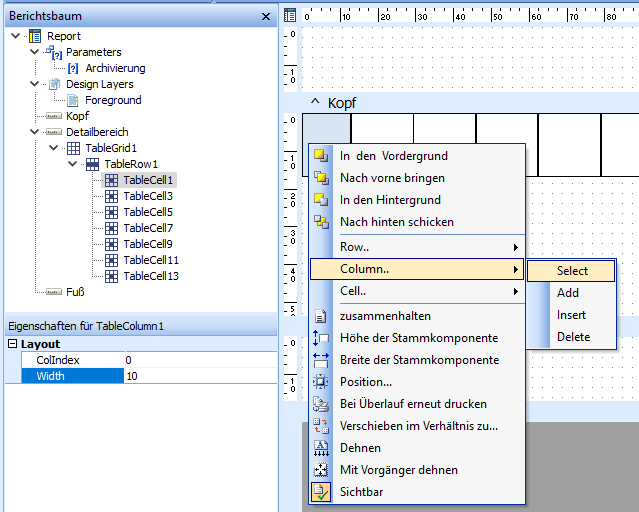

### Die Tabelle mit Inhalt füllen

Wählen Sie anschließend Label aus und klicken in die Tabellenfelder der Kopfzeile, um Beschriftungen hinzuzufügen.

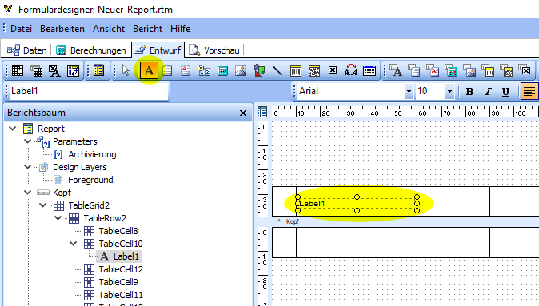

Anschließend ziehen Sie alle Felder passend in eine Reihe. Nutzen Sie dazu die blaue magnetische Hilfslinie. Zentrieren Sie die Zelle anschließend horizontal und vertikal und wählen Sie Fettdruck.

Nun müssen die Tabellenfelder aus der Datenbank heraus gefüllt werden. Dafür bietet sich in den meisten Fällen ein DB Textfeld (Das A-Symbol mit der Tabelle im Hintergrund) an. Klicken Sie darauf und dann in ein Tabellenfeld im Detailbereich. Hier ist die Datenquelle des Reports (also hier Lehrer) voreingestellt.

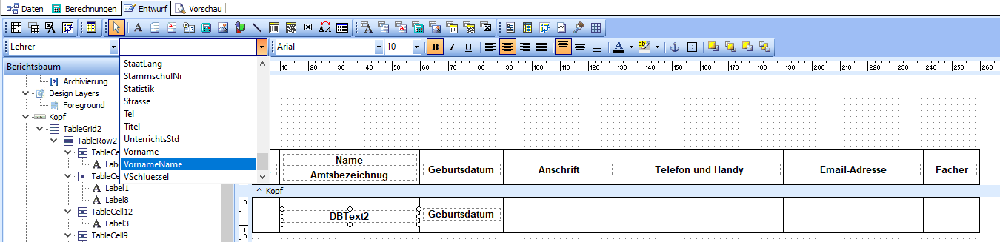

Wählen Sie die passenden Felder außer dem Zähler und den Fächern. Bei der Anschrift wählen Sie die obere Zeile und wählen Straße aus. Die anderen Felder müssen über eine Programmierung gefüllt werden.

### PLZ und Ort über eine einfache Programmierung kombinieren

Wenn Sie die Postleitzahl und den Ort in eine Tabellenzelle setzen wollen, stoßen Sie auf die Schwierigkeit, dass diese nicht direkt hintereinander stehen. Dieses Problem kann man über eine einfache Programmierung lösen.  
Wahlen Sie statt eines DBText-Feldes ein Label aus (A-Symbol ohne Tabelle im Hintergrund) und klicken in die Stelle der Tabelle im Detailbereich, in der PLZ und Ort der Lehrkräfte erscheinen soll. Merken Sie sich die Nummerierung ihres Labels. In unserem Beispiel ist es Label 9.

Unter dem Ereignis OnGetText wird in einem einfachen Code programmiert, was in dem Label ausgegeben werden soll. Dazu bietet der Reportdesigner Hilfen an, um die entsprechenden Datenfelder der Datenbank anzusteuern.

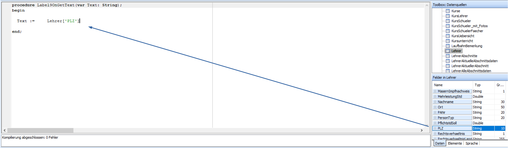

Wählen Sie in der Toolbox die Datenquelle Lehrer aus und suchen Sie unter den Elementen die PLZ und Ort. Diese Datenfelder können dann mit der Maus aus der Toolbox unten rechts in das Programmierfeld gezogen werden.
Würden Sie beide Elemente direkt hintereinander hinziehen wird das Skript nicht kompiliert, ist also fehlerhaft. Die Syntax verlangt hier den mathematischen Operator +. Es muss also mindestens so in ihrem Programmierfeld stehen:

    begin
        Text := Lehrer['PLZ'] + Lehrer['Ort'];
    end;

Auf diese Weise erscheinen allerdings PLZ und Ort direkt aneinander ohne Leerzeichen. Diese Leerzeichen müssen wir ebenfalls über die Programmierung einbauen. Dazu verwenden Sie das Hochkomma '. Dieses rahmt Leerzeichen ein und muss natürlich auch über Pluszeichen in die Programmierung eingebunden werden. Ihre Programmierung sollte daher so lauten:

    begin
        Text := Lehrer['PLZ'] + ' ' + Lehrer['Ort'];
    end;

Durch das in Hochkommata eingeschlossene Leerzeichen wird der Abstand generiert. Hier können auch andere Sonderzeichen oder Wörter nach Belieben eingesetzt werden. Alle was in Hochkommata steht, wird als Text ausgegeben.

### Einen laufenden Zähler einbauen

Wählen Sie einen DBCalc (Taschenrechnersymbol mit Tabelle im Hintergrund) und klicken in den Detailbereich in die erste Zelle, die den Zähler enthalten soll.

Standardmäßig ist hier "Summe" voreingestellt, was uns hier nicht sinnvoll ist. Wir benötigen einen laufenden Zähler. Klicken Sie mit der rechten Maustaste auf das Calc-Feld und wählen Berechnungen.

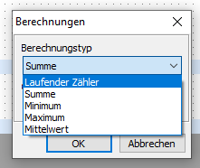

In dem nun erscheinenden Menü wählen Sie oben die Option "Laufender Zähler" aus.

### Fächer der Lehrer hinzufügen - Subreport mit untergeordneter Datenquelle

Bisher gab es immer eindeutige Zuordnungen: Ein Lehrer hat _einen_ Namen, _einen_ Vornamen, _eine_ Adresse, _ein_ Kürzel. Im Gegensatz dazu hat ein Lehrer mehrere Fächer. Genaugenommen kann ein Lehrer ein Lehramt (z. B. Primarstufe), welchem dann diese Fächer zugeordnet sind. Theoretisch kann ein Lehrer auch mehrere Lehrämter haben, denen wiederum verschiedene Fächer zugeordnet sind.  
Beispielsweise kann ein Lehrer die Lehrämter Sonderpädagogik und Grundschule erworben haben. Dem Lehramt Sonderpädagogik könnten die Fächer (Lehrbefähigungen) Brailleschrift und Textiles Gestalten, dem Lehramt Grundschule die Lehrbefähigungen Deutsch und Sachkunde zugeordnet sein.

Eine solche Kombination ist sicherlich unwahrscheinlich, aber dennoch möglich und muss somit in der Datenbank abgebeildet werden. Man findet die Fächer der Lehrer in SchILD unter Schulverwaltung - Lehrkräfte - Details - Zeitabhängige Daten.
Um eine solche mehrdeutige Beziehungen im Report abbilden zu können, benötigt man Unterberichte (Subreports).

Wählen Sie die Option Unterbericht und klicken dann in den Detailbereich.

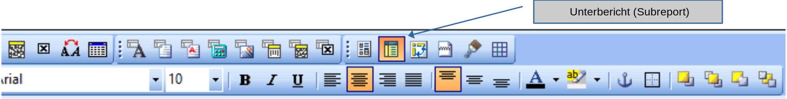

Klicken Sie mit der rechten Maustaste auf den nun erscheinenden Subreport1 und wählen Sie die Option "Breite der Stammkomponente" ab. Nun können Sie den Subreport kleiner ziehen und in Ihre Tabelle ziehen. Wählen Sie unten links im Reportdesigner die Karteikarte SubReport1.

In diesem klicken Sie wieder auf Bericht - Datenquellen und wählen die Datenquelle LehrerLehramt aus. Wählen Sie nun Bericht und deaktivieren Sie die Optionen Titel und Zusammenfassung.

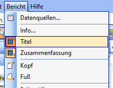

Nun passen wir die Seite an die Dimensionen der Tabelle an. Gehen Sie dazu auf Datei - Seite einrichten. Stellen Sie bei Papiergröße die Größe des Tabellenfeldes ein. In unserem Beispiel 20x13.

Unter "Ränder" stellen Sie alle Ränder auf 0.

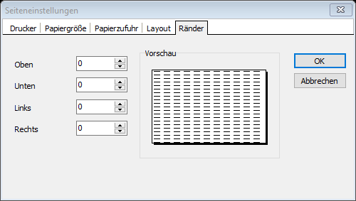

Klicken Sie erneut auf Bericht und dann in den kleinen Detailbereich. Sie haben nun einen Subreport im Subreport. Wählen Sie die nun neue Unterberichtskarteikarte (Subreport2) aus und stellen Sie hier die Datenquelle LehrerLehrbefaehigung ein. Stellen Siue die andere Formatierung wie gerade beim ersten Unterbericht ein. Setzen Sie in den Detailbereich ein DBText-Feld und weisen diesem die LehrbefKrz zu.

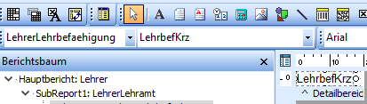

Nun werden im Report die Fächer der Lehrer untereinander angegeben, was nicht besonders schön aussieht. Ändern sie dies im Subreport2 unter Datei - Seite einrichten - Layout

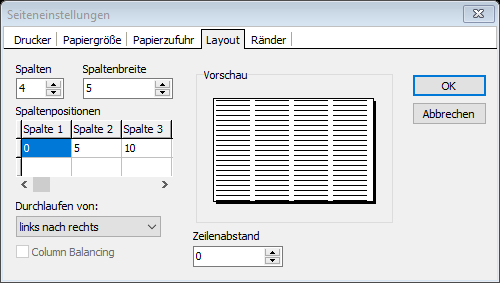

Wählen Sie bei "Durchlaufen von:" links nach rechts und drei Spalten aus.

### Sortierung der Tabelle steuern

Ist die Datenquelle des Berichts nicht "Schüler", so ist die Tabelle nicht notwendigerweise richtig sortiert. Um die gewünschte Sortierung vorzunehmen, gehen Sie in den Hauptbericht und dann auf Berechnungen.

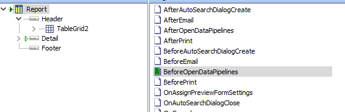

Klicken Sie auf BeforeOpenDataPipelines und geben in die Programmiermaske die Sortierung ein:

    begin
        SetzeSortierung(Report.Datapipeline,'Nachname,Vorname,Geburtsdatum');
    end;

Dabei dürfen die Sortierfelder wie Name, Vorname nur ein Komma, nicht durch ein zusätzliches Leerzeichen getrennt werden. Achten Sie darauf, den Sortiernamen genau wie das Datenbankfeld zu nennen.
Würden wir hier zuerst das Geburtsdatum setzen, hätten wir eine Geburtstagsliste gemacht.  
Befehle wie SetzeSortierung sind auf der Webseite von SchILD-NRW dokumentiert. Sie finden sie unter der URL [RAP-Funktionen](https://wiki.svws.nrw.de/mediawiki/index.php?title=RAP-Funktionen)

### Hintergrundprogrammierung zur Anpassung eines DB-Textes

Bei den Telefonnummern wäre es schön, hier vor der Nummer anzugeben, ob diese Nummer zu einem Handy oder Telefon gehört und dass, wenn keine Nummer vorhanden ist, dieses auch ausgegeben wird.
Dazu klicken Sie den DB-Text des Telefons an und gehen in die Berechnungen und hier wieder in die Berechnungen des OnGetText. Geben Sie hier ein:

    begin
        if Lehrer['Tel'] = ''
        then Text := 'kein Telefon'
        else Text := 'Tel: ' + Lehrer['Tel'];
    end;

Hier wird durch die Abfrage geprüft, ob bei der Telefonnummer ein Eintrag vorliegt und wenn nicht (zwei Hochkommata _ohne_ Leerzeichen dazwischen), wird ausgegeben, dass keine Nummer vorliegt. Andernfalls wird vor die Nummer ein "Tel:" gesetzt. Diese Programmierung gehört zu den Standards, die immer wieder benötigt werden. Daher passen Sie die Programmierung der Lehrerhandynummer und der E-Mailadressen (privat/dienstlich) analog an.

### Tabellenzeilen farbig ausgeben

Bei manchen Listen empfiehlt es sich zur Erhöhung der Übersichtlichkeit, dass die Tabellenzeilen unterschiedliche Farben haben.
Klicken Sie auf den Detailbereich im Berichtsbaum. Wählen können Sie die Einfärbung der Spalten über Background1 -> Brush - Color in einem Menü auswählen. Verfahren Sie bei Backgroud2 analog.

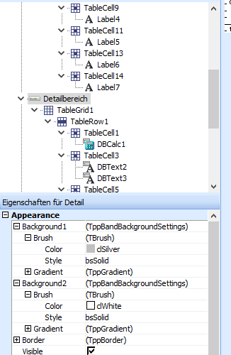

### Einpassen der Textelemente in eine Zelle

Um die Textelemente in der Tabelle möglichst genau zu zentrieren, empfiehlt es sich, diese in der Tabelle nach allen Seiten zu verankern. Klicken Sie dazu bei Elementen, die alleine in einem Feld stehen, dieses Datenfeld an und geben im Eigenschaftenbereich unter Layout die Anchors an allen vier Seiten (aBottom, aLeft, aRight, aTop) an.

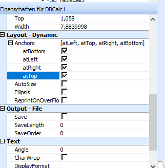

Bei Elementen, die sich ein Tabellenfeld teilen, wählen Sie bei dem oberen nur aTop, aLeft, aRight und bei dem unteren aBottom, aLeft, aRight.

## Erstellen einer Schüler-Telefonliste

### Vorarbeiten

Im Folgenden soll eine Schülerliste erstellt werden, die sämtliche Telefonnummern enthält. Das Ergebnis soll in etwa so aussehen:

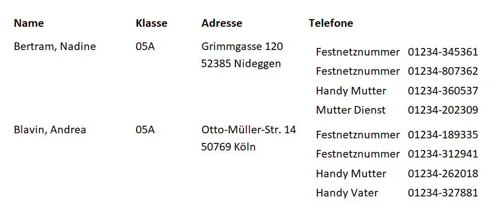

Auf verzierende Elemente wie TableGrid wurde hier verzichtet.

Zum Erstellen einer Schülerliste geht man zunächst analog zur Erstellung einer Lehrerliste wie wie vorher beschrieben vor. Im Gegensatz zu einer Lehrerliste ist hier allerdings die Angabe einer Datenquelle nicht notwendig, da Schild-NRW als schülerzentriertes Programm die Datenquelle Schüler voreingestellt hat. Der Entwurf ist hier zu sehen.

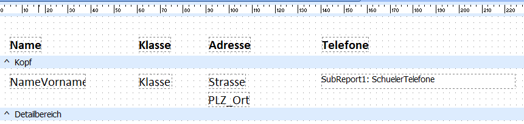

Im Kopfbereich sind Labelfelder angeordnet, die mit "Name", "Klasse" etc. beschriftet sind. Im Detailbereich sind die entsprechenden DBText-Felder angeordnet. Im Gegensatz zur Datenquelle "Lehrer" gibt es bei den Schülern bereits häufig verwendete Felder bereitgestellt, so dass hier keine Programmierung notwendig ist. Man findet so die Felder "NameVorname" und auch "PLZ_Ort".  
Da zu jedem Schüler mehrere Telefonnummern existieren können und diese Zuordnung nicht eindeutig ist, benötigen wir dafür einen Subreport. Diesem weist man die Datenquelle "SchuelerTelefone" zu und kann im Subreport die Felder "Telefonart" und "Telefonnummer" einfügen.

### Gruppierung

Druckt man eine solche Liste aus, stellt man fest, dass am Ende einer Klasse einfach mit der nächsten Klasse begonnen wird, ohne einen Seitenumbruch einzufügen.

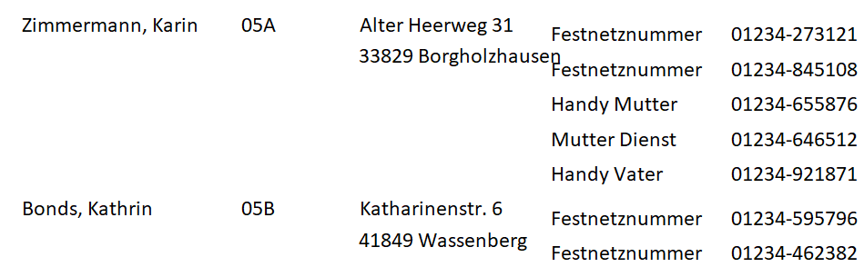

Die Lösung ist, dass der Bericht nach Klassen gruppiert wird. Dazu muss man im Hauptbericht Bericht - Gruppen anwählen.

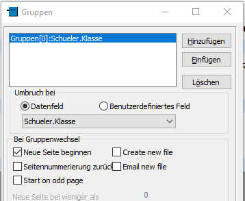

Wählen Sie das Datenfeld "Schueler.Klasse" und klicken Sie auf "Hinzufügen". In einem zweiten Schritt können die unteren Kästchen angeklickt werden. Wir wollen bei Erreichen der nächsten Klasse einen Seitenumbruch einfügen. In dieser Einstellung wird, sobald sich die Klasse ändert, ein Seitenumbruch eingefügt. Falls Sie gerne doppelseitig drucken und Sie nicht möchten, dass auf der Vorderseite die 5A und auf der Rückseite die 5B auftaucht, klicken Sie zusätzlich auf "Start on odd page".  
Jetzt wird für jede Klasse eine neue Seite begonnen. Allerdings kann es weiterhin passieren, dass Schülerdaten beim Seitenumbruch auseinandergerissen werden und die Daten teils auf der einen, teils auf der anderen Seite landen.

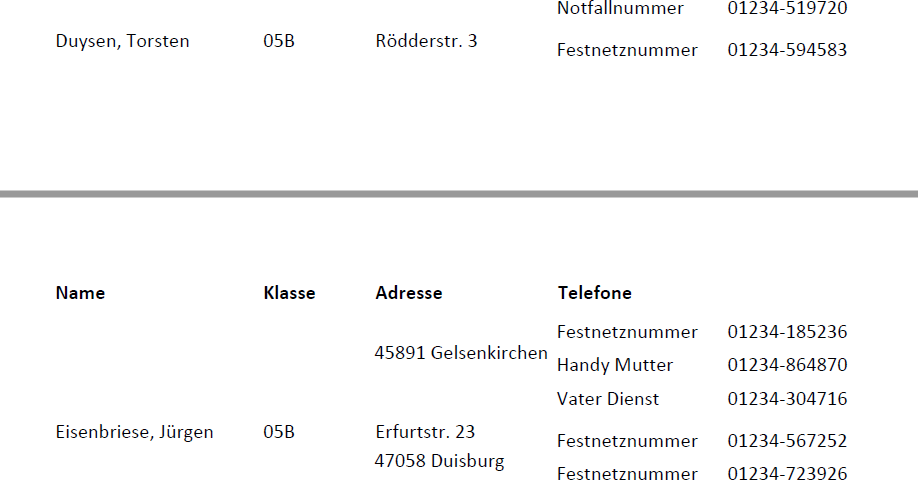

Das Ziel ist es, dass alle Daten eines Schülers entweder auf der einen oder auf der anderen Seite erscheinen. Auch dieses Problem lässt sich mit Gruppierung lösen.
Wählen Sie wiederum "Bericht" – "Gruppen", klicken Sie erst auf "Hinzufügen" und wählen "Schueler.ID". Unten ist das Feld "Gruppe zusammenhalten" bereits angehakt. Das Ergebnis sollte so aussehen:

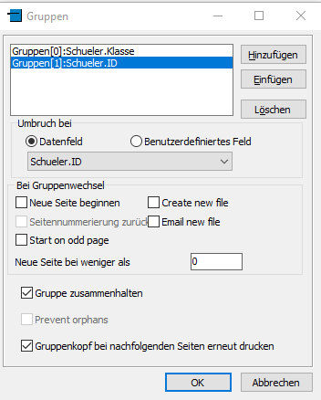

Diese Einstellungen bewirken, dass alle Daten, die zu einem Schüler gehören, zusammen auf einer Seite erscheinen und zwischendurch kein Seitenumbruch stattfindet. Dazu muss man zwei Schüler eindeutig voneinander unterscheiden können. Der Nachname reicht dabei nicht notwendigerweise aus, denn auch Zwillinge in einer Klasse haben den gleichen Nachnamen. Zur Unterscheidung eignet sich immer die ID eines Schülers. Die ID ist eine Schülernummer, die Schild-NRW automatisch generiert und die garantiert eindeutig ist. Mit diesen beiden Angaben sollte die Telefonliste wie gewünscht funktionieren.

### Zugriff auf Objekteigenschaften mittels Programmierung

Auf alle Eigenschaften eines Elements, die Sie im Eigenschaftenfenster sehen, können Sie über die Programmierung zugreifen und diese verändern. Als Beispiel soll eine Liste erstellt werden, in denen der Status der Masernschutzimpfung ausgegeben wird. Dazu erstellen wir eine neue Liste mit Schülernamen und dem Status der Masernschutzimpfung. Diese findet man normalerweise über ein Datenbankfeld, hier soll aber ein Label programmiert werden. Fügen Sie also ein Label in den Detailbereich ein.

Bei komplexen Reports kann es sehr sinnvoll sein, einzelne Elemente wir Label, DBTexte etc. mit besonderen Namen zu versehen. Dies kann die Übersichtlichkeit enorm steigern. Klicken Sie beispielsweise auf ein Label oder jedes andere Element, dass Sie umbenennen wollen und gehen Sie im linken unteren Bildschirmrand auf die Eigenschaften des Objektes in der Entwurfsansicht.  Hier können alle Elemente unter dem Bezeichner UserName umbenannt werden.

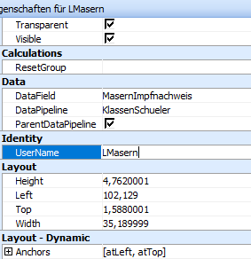

Es kann in einigen Fällen sinnvoll sein, bestimmte Merkmale in einer Liste hervorzuheben, bzw. kenntlich zu machen. Am Beispiel des "Masernimpfnachweises" soll dies hier illustriert werden. Dieser liegt in der Datenbank als String-Wert in Form eines + oder – vor, also vorhanden und nicht vorhanden.  
In einem DBText-Feld, welches die Bezeichnung "LMasern" von uns erhalten hat, wird eine Programmierung eingebaut, die dafür sorgt, dass ungeimpfte Schülerinnen und Schüler den fett und rot gedruckten Hinweis erhalten, dass sie keinen Impfschutz besitzen. Die geimpften erhalten in normal gedruckten grünen Lettern den Hinweis, dass ein Impfschutz vorhanden ist.

Dies kann in zwei Schritten umgesetzt werden. Zum einen muss dem Label LMasern ein Text zugewiesen werden. Die kann nur über das Ereignis OnGetText geschehen. Der Code sieht dabei so aus:

    Procedure LMasernOnGetText(var Text: String);
    begin
        if Schueler['MasernImpfnachweis'] = '-'
        then
            Text := 'kein Masernschutz'
        else
            Text := 'Masernschutz vorhanden';
    end;

Weiterhin muss dem Text auch das Format zugewiesen werden. Diese unterscheidet sich allerdings von der Logik, wie Elemente angesporchen werden. Prinzipiell kann man auch versuchen, die Formatierung über OnGetText durchzuführen. Allerdings ist diese dann schon vorgenommen worden, so dass die Formatierung dann erst beim nächsten Schüler angewendet wird.
Statt dessen verwendet man die Methode OnPrint:

    Procdeure LMasernOnPrint;
    begin
        if Schueler['MasernImpfnachweis'] = '-'
        then
        begin
            LMasern.Font.Color := clRed;
            LMasern.Font.Bold := true;
        end
        else
        begin
            LMasern.Font.Color := clGreen;
            LMasern.Font.Bold := false;
        end;
    end;

Wollen Sie dagegen eine Liste haben, bei der die nur die ungeimpften Schüler ausgegeben werden, kann man das über die Eigenschaft "visible" erreichen. Diese soll sich auf die gesamt Detailzeile auswirken. Geben Sie beim Objekt "Detail" in dem Ergeignis "DetailBeforePrint" folgendes ein:

    if Schueler['MasernImpfnachweis'] = '-'
    then
        detail.visible := true
    else
        detail.visible := false;

Wer Programmiererfahrugn hat, kann dies auch abkürzen:

    detail.visible := (Schueler['MasernImpfnachweis'] = '-');

## Kreuztabellen

### Ein erstes Beispiel

Kreuztabellen stellen eine hervorragende Möglichkeit dar, Datenmengen zusammenzuführen und übersichtlich auszuwerten. Als Einstiegsbeispiel soll eine Übersicht erstellt werden, wie viele Schüler sich in welcher Klasse befinden. Da in einer Kreuztabelle generell alle ausgewählten Schüler ausgewertet werden, ist es während der Entwicklung der Tabelle ratsam, die Schülermenge einzuschränken. Ansonsten kann das Anzeigen der Kreuztabelle unnötig lange dauern. Im Folgenden beschränken wir uns auf die Jahrgangsstufe 05.  
Wir erstellen einen neuen Bericht und fügen in den Detailbereich eine Kreuztabelle ein.

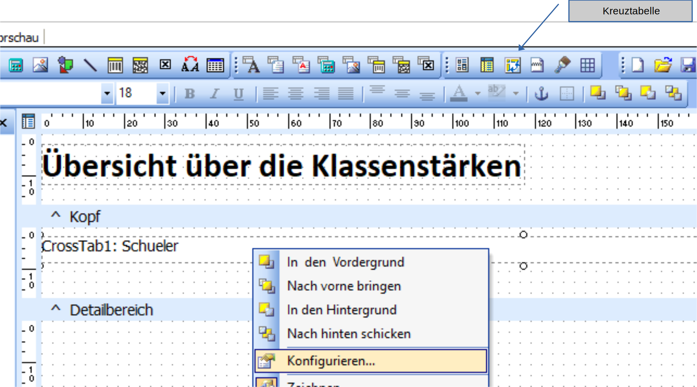

Klicken Sie nun mit der rechten Maustaste auf das Element CorssTab und wählen "Konfigurieren".

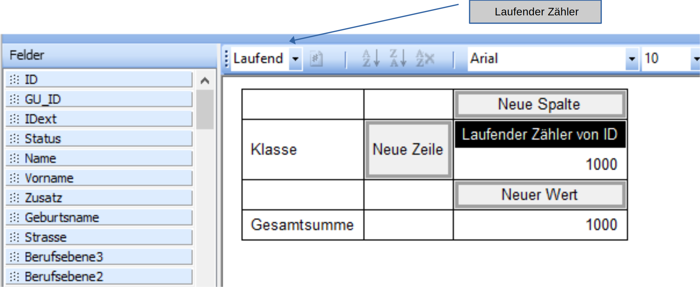

In der linken Spalte sehen Sie die Felder, die sie auswerten können. Unglücklicherweise sind die Felder nicht alphabetisch sortiert, so dass man ab und zu Mühe hat, die richtigen Felder zu finden. Als Faustregel können Sie sich merken, dass die Felder in chronologischer Reihenfolge erscheinen. Wichtige Felder erscheinen oben, später hinzugekommene wie "MasernImpfnachweis" viel weiter unten.

Suchen Sie nun das Feld "Klasse" und ziehen Sie es an die Stelle "Neue Zeile" wie in Abbildung 26. Ziehen Sie nun das Feld "ID" an die Stelle "Neuer Wert". Ändern Sie nun die Berechnung von "Summe" in "Laufender Zähler". Wenn Sie nun mit "OK" bestätigt haben, finden Sie in der Vorschau Sie nun die Ausgabe wie in der nächsten Abbildung.

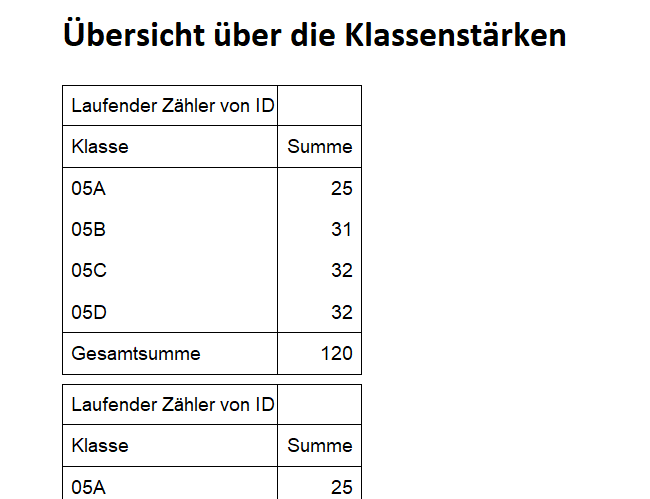

Das sieht vielversprechend aus. Zu jeder Klasse wird die Anzahl der Schüler ausgegeben. Allerdings taucht die Kreuztabelle wiederholt auf. In der jetzigen Einstellung wird für jeden Schüler eine eigene Kreuztabelle ausgegeben. Das liegt daran, dass die Datenquelle des Berichts "Schüler" ist und somit für jeden vorkommenden Schüler der Detailbereich – und damit die Kreuztabelle – erneut ausgegeben wird.  
Da die Kreuztabelle nur einmal ausgegeben werden soll, stellen Sie die Datenquelle des Berichts auf "keine". Trotzdem sollen in der Kreuztabelle die Schüler ausgewertet werden, so dass wir diese Datenquelle nur der Kreuztabelle zuweisen. Markieren Sie in der Entwurfsansicht die Kreuztabelle und stellen Sie oben die Datenquelle für die Schüler ein.

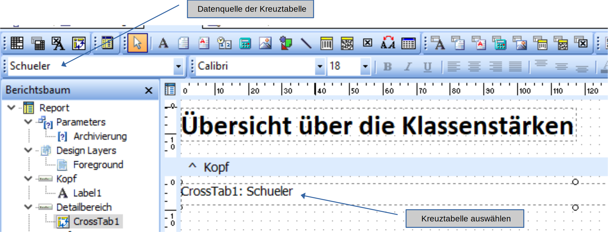

Somit taucht die Kreuztabelle nur noch ein einziges Mal auf.

### Ein komplexeres Beispiel

Das bisherige Beispiel soll nun erweitert werden. Es soll zusätzlich noch ausgegeben werden, wie viele Jungen und Mädchen in welcher Klasse sind. Zusätzlich soll eine Gesamtübersicht über jede Jahrgangsstufe ausgegeben werden. Ändern Sie in der Entwurfsansicht die Kreuztabelle ab wie in der folgende Abbildung angezeigt.

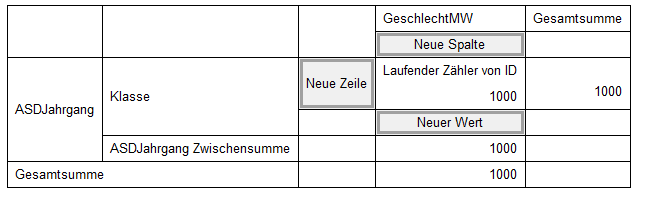

Achten Sie darauf, die Felder "ASDJahrgang" statt "Jahrgang" sowie "GeschlechtMW" statt "Geschlecht" zu verwenden. Schauen Sie sich nun die Vorschau an. Sie haben mit relativ einfachen Mitteln eine Übersicht geschaffen.
Der Phantasie sind die Grenzen nur durch die Papiergröße gesetzt. Manchmal benötigt man statistische Auswertungen wie Religionsübersichten, Verteilung der Wohnorte oder Förderschwerpunkte. Wenn die Übersicht zu groß wird, kann man auch mit einer Umstrukturierung der Tabelle etwas Übersichtlichkeit schaffen. Die Namen der Wohnorte können recht lang werden, so dass es sich anbietet, diese untereinander zu schreiben. Die Namen der Klassen sind kurz, so dass diese nebeneinander angeordnet werden können.

## Schreiben eines Serienbriefes

In den Basisreportsammlung werden auch Vorlagen für Serienbriefe sowohl an Eltern als auch an Schüler bereitgestellt, die recht bequem erstellt werden können. Speziell für diese Serienbriefe existiert im gleichen Verzeichnis auch eine ausführliche Anleitung, so dass hier nur Grundzüge erläutert werden.

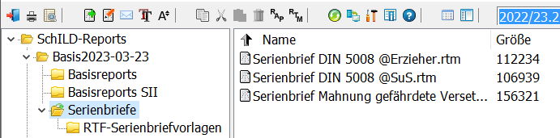

Im Beispiel soll ein Erzieherbrief geschrieben werden, der die zukünftigen Schüler zu einem Kennenlernnachmittag einlädt. Wählen Sie dazu den Brief an die Erzieher aus. Sie werden danach gefragt, ob Sie eine Vorlage einbinden möchten, was wir zunächst nicht wollen.
Es öffnet sich nun ein Editorfenster, in das Sie den Brieftext schreiben können. Um den Brief persönlich zu gestalten, stehen viele Variablen zur Auswahl, die bei Druck des Briefes durch entsprechende Datenbankfelder ersetzt werden. Der Brieftext könnte z. B. so aussehen:

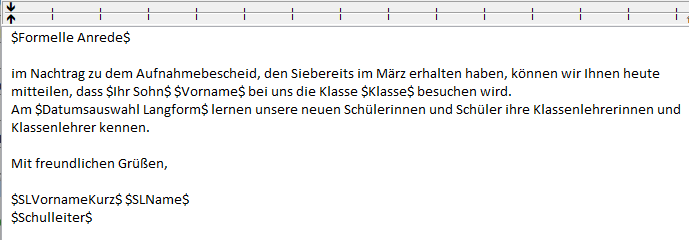

Sollten Sie diesen Text des Öfteren verwenden, können Sie ihn sich vor dem Druck abspeichern und beim nächsten Mal wieder laden.
Die Variablen $Formelle Anrede$, $Vorname$ etc. sehen nach dem Druck so aus:

Bei den Serienbriefen liegt eine eigene Dokumentation bei, in der die Vorgehensweise und auch alle verwendbaren Variablen genau aufgelistet werden. Sie können den Briefinhalt auch mit Ihrer gewohnten Textverarbeitung erstellen. Sie müssen den Text aber im RTF-Format abspeichern ("Speichern unter").

## Erstellen von Serienbriefen mit Programmierung

Dieses Kapitel benötigen Sie nur, wenn Ihnen die gerade vorgestellten Serienbriefe zu unflexibel sind oder Sie genre Ihre Kenntnisse über in die Programmierung von Reports vertiefen möchten.

### Notwendige Vorarbeiten

Die Briefe beziehen sich auf die einzelnen Schüler der Schule, sollen aber an die Erziehungsberechtigten geschickt werden. Daher ist es notwendig, dass der Brief primär dem Schüler zugeordnet ist, aber an den Erzieher gerichtet ist. Hier muss mit einem Subreport gearbeitet werden, da es zu jedem Schüler möglicherweise mehrere Erzieher geben kann. Daher muss man mit einem Subreport arbeiten.  
Klicken Sie auf Bericht und dann auf Kopf und Fuß, um nur noch den Detailreich anzuzeigen.
Nun muss in diesen Bericht ein Subreport eingefügt werden, der der Datenquelle "Erzieher" zugeordnet ist. Klicken Sie auf Unterbericht und dann in den Detailbereich.

Bitte verwechseln Sie das Symbol nicht mit dem ähnlich aussehenden Symbol "Dynamisch ladbarer Subreport" auf der rechten Seite. Schieben Sie den Detailbereich dann so zusammen, dass nur noch der Subreport zu sehen ist.
Wählen Sie über die Registerkarten im unteren linken Bildschirmbereich den Subreport1 aus.

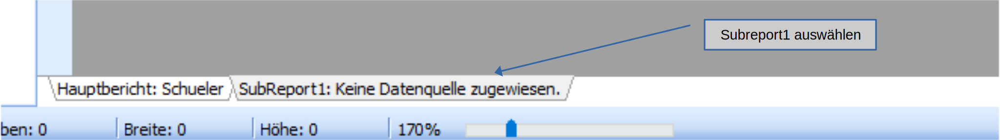

 Diesem weisen Sie nun über "Bericht" – "Datenquellen" die Datenquelle "Erzieher" zu. In diesem Subreport wird nun der eigentliche Brief geschrieben.

### Nur Erzieher mit Anschreiben

Der Brief soll ja nur an Erziehungsberechtigte gehen, daher an Personen, bei denen unter dem Karteireiter Erzieher auch ein Häkchen bei "Erhält Anschreiben" gesetzt ist. Dies wird im Hauptbericht gesteuert. Gehen Sie zurück in den Hauptbericht und dann von der Entwurfs in die Berechnungsansicht. Hier wird in den Ereignissen BeforePrint und AfterPrint die Ausgabe des Briefes gesteuert. In BeforePrint muss über die Programmierung gesteuert werden, dass nur Erzieher den Brief erhalten, die auch ein Anschreiben erhalten sollen. Geben Sie hier ein:

    begin
        NurErzieherMitAnschreiben(True);
    end;

Nachdem Report vollständig kompiliert wurde, muss er wieder in den Ursprungszustand gebracht werden. Dafür muss die Operation in AfterPrint rückgängig gemacht werden. Geben Sie hier ein:

    begin
        NurErzieherMitAnschreiben(False);
    end;

Nun müssten beide Ereignisse grün erscheinen:

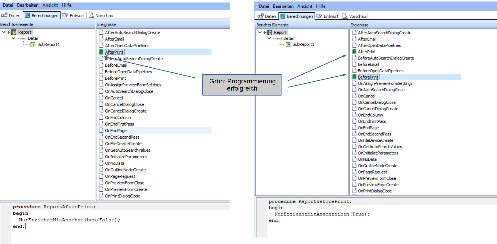

### Erziehergruppen

Hat ein Schüler mehrere Erziehungsberechtigte, die alle ein Anschreiben erhalten sollen, muss dies im Report gesteuert werden, da ansonsten nur der erste in SchILD aufgelistete einen Brief erhalten würde. Gehen Sie auf den Supreport1:Erzieher in der Entwurfsansicht und klicken auf "Bericht" – "Gruppen".
Wählen Sie im Drop-Down-Menu die Erzieher.ID und klicken auf hinzufügen. Setzten Sie dann einen Haken bei Neue Seite beginnen und bestätigen mit OK. Entfernen Sie den Hacken bei Gruppenkopf bei nachfolgenden Seiten erneut drucken.

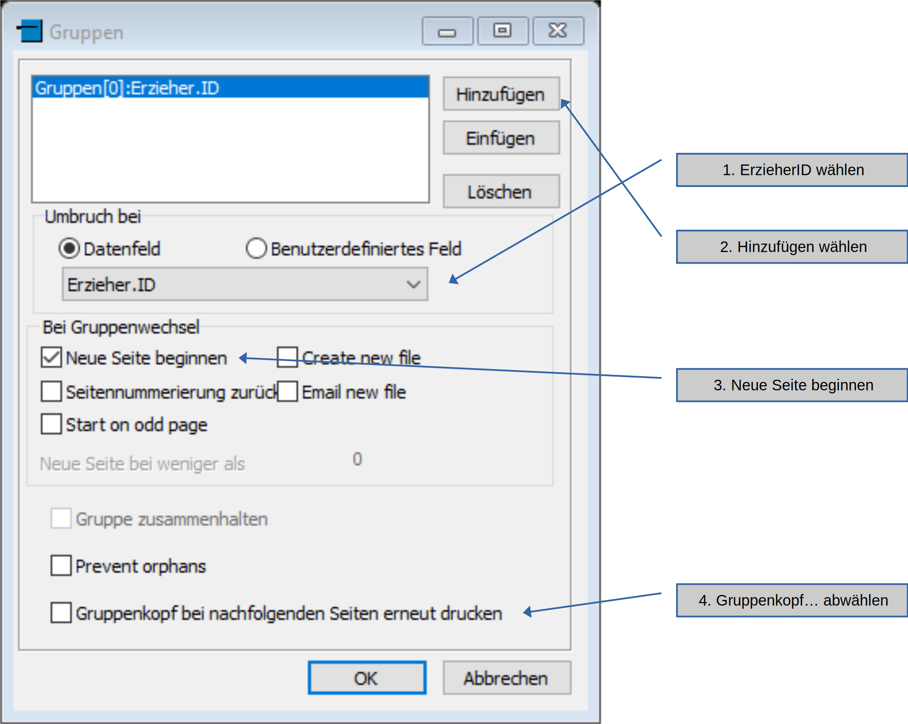

### Brieftext in Richtext einbauen

Den Text des eigentlichen Briefes sollte man in einem RichText eingeben. Klicken Sie auf RichText und dann in der Entwurfsansicht des Subreport1 in den Detailbereich.

Klicken Sie den mit der rechten Maustaste an und wählen Sie Bearbeiten. Es öffnet sich dieses Fenster:

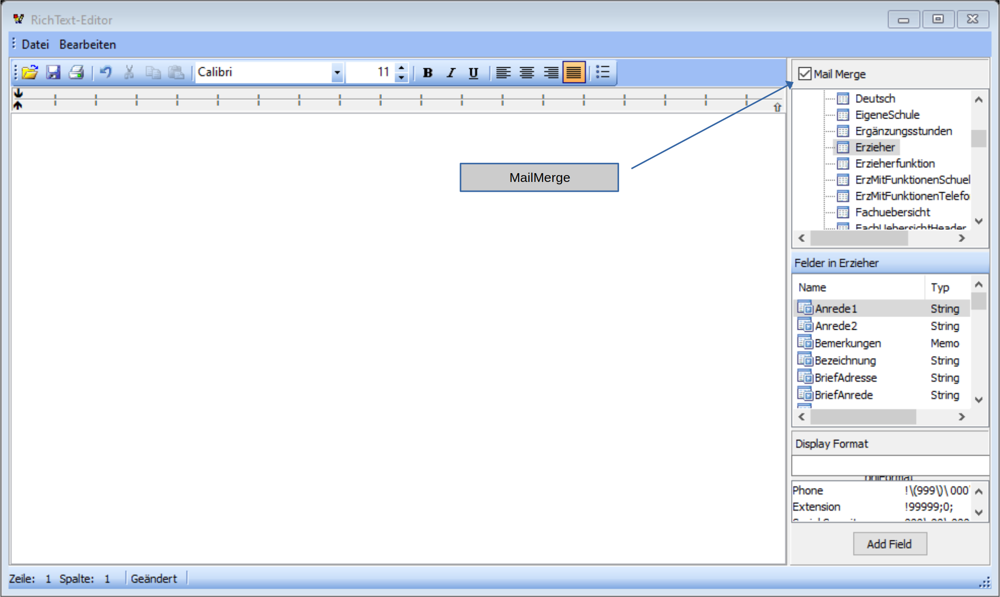

In dem großen Feld können Sie zum einen schreiben, wie in einem Word-Dokument. Sie können hier aber auch über Datenbankabfragen einen individuellen Brieftext generieren lassen. Dazu setzen Sie oben rechts den Haken bei Mail Merge.

Darunter können Sie Die Datenquellen aus der Datenbank ansteuern und darunter die entsprechenden Datenfelder auswählen. Wenn Sie an eine Stelle kommen, bei der eine Abfrage sinnvoll ist, können Sie dies hier per Doppelklick hinzufügen. Schließen Sie das Feld (X oben rechts) nach der Eingabe und bestätigen Sie die Speicherung. Ziehen Sie das Feld anschließend in der Entwurfsansicht größer, sodass der Brieftext zentriert ist. In unserem Beispiel sieht dieser nun so aus:

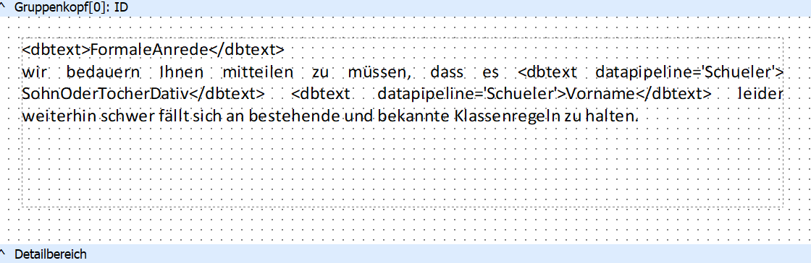

### Eine Texteingabe (Variable) in den Text einbauen (ReplaceText)

Wir wollen nun in unserem Brief eine Abfrage einbauen, die es ermöglicht, einen variablen Text einzugeben. Sie können dazu in der Bearbeitungsansicht des RichText eine Variable in den Text einbauen. Wir nennen sie in unserem Beispiel die Variable "Verhalten". Eine Variable ist im Text durch die Einrahmung durch $-Zeichen gekennzeichnet. In unserem Text müssen wir also $Verhalten$ schreiben.

Damit diese Variable auch bearbeitet wird, müssen wir in die Programmierung wechseln. Gehen Sie auf den Richtext1 und auf das Ereignis OnMailMerge.

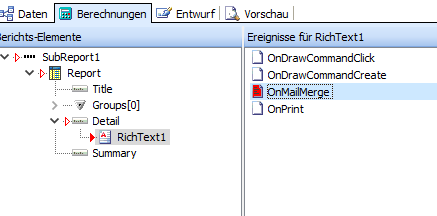

Geben Sie in die Programmierung das Folgende ein: (Nicht wundern, dass es noch Rot ist!)

    begin
        RichText1.RichText := ReplaceText (RichText1.RichText, '$Verhalten$',Verhalten);
    end;

Nun müssen wir die Variable noch global als solche definieren. Wechseln Sie zum Hauptbericht:Schueler und gehen in die Berechnungen. Wechseln Sie die Ansicht auf "Verwendete Module" und klicken auf "Deklarationen" – "Variablen".

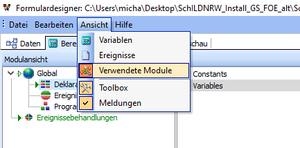

Wir definieren nun die Variable "Verhalten" als Zeichenfolge, einen sogenannten String. Geben Sie bei Programmierung ein:

    Verhalten: String;

Wechseln Sie wieder die Ansicht auf "Ereignisse" und gehen in die Operation "Report" – "BeforePrint". Hier sollten schon bspw. die Erzieher mit Anschreiben Programmierung stehen. Gehen Sie eine Zeile darunter und implementieren Sie die Textabfrage. Sie geben hier den Befehl, dass ein Texteingabefeld generiert werden soll und in unserem Falle einen sprachlichen Hinweis, der den Anfang des Satzes beschreibt. Schreiben Sie:

    begin
        Verhalten := Stringinput('Bitte das Fehlverhalten benennen: (...zu erwähnen, dass er/sie: ','');
    end;

Da ja bei Jedem Schüler der Text angepasst werden soll, muss dieser vor jeder Reporterzeugung gesichert werden und danach wieder in den Ursprungszustand geschrieben werden. Dazu gehen Sie im Supreport1:Erzieher in den Detailbereich und wechseln in die Berechnungsansicht. Klicken Sie auf den Detailbereich und Programmieren diese Sicherung, bzw. Wiederherstellung des Richtextextes in den Ereignissen BeforePrint und AfterPrint.

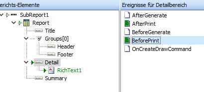

Schreiben Sie bei BeforePrint:

    begin
        SaveText := Richtext1.Richtext;
    end;

Schreiben Sie bei AfterPrint:

    begin
        Richtext1.Richtext := SaveText;
    end;

Sie müssen nun noch SaveText als Variable definieren. Gehen Sie auf den Hauptbericht und auf Berechnungen. Wechseln Sie die Ansicht auf Verwendete Module. Klicken Sie wieder auf Deklarationen - Variables und geben hier ein: (Sollte hier schon etwas stehen, einfach eine neue Zeile aufmachen.)

    SaveText: String;

Nun ist Ihre Anfrage komplett.

### Eine Datumsabfrage in den Text einbauen

Wir wollen nun vor der Abfrage des Fehlverhaltens noch eine Datumsauswahl einbauen, damit wir dies auch klar benennen können. Also brauchen wir eine weitere Variable. Gehen Sie auf den Hauptbericht und auf Berechnungen. Wechseln Sie die Ansicht auf Verwendete Module. Klicken Sie wieder auf Deklarationen - Variables und geben hier ein: (Sollte hier schon etwas stehen, einfach eine neue Zeile aufmachen.)

    Datum: String;

Gehen Sie nun in den Subreport1:Erzieher in die Entwurfsansicht und geben die Variable im RichText ein. In unserem Beispiel lautet dieser nun:

    <dbtext>FormaleAnrede</dbtext>
    wir bedauern Ihnen mitteilen zu müssen, dass es <dbtext datapipeline='Schueler'>SohnOderTocherDativ</dbtext> <dbtext datapipeline='Schueler'>Vorname</dbtext> leider weiterhin schwer fällt sich an bestehende und bekannte Klassenregeln zu halten. Besonders ist hier zu erwähnen, dass <dbtext datapipeline='Schueler'>ErSieKlein</dbtext> am $Datum$ $Verhalten$.

Gehen Sie nun in die Berechnungen des Hauptberichtes und wählen den Report und das Ereignis BeforePrint. Geben Sie ein:

    Datum := WaehleDatumStr('Wann fand das Fehlverhalten statt?', true);

Nun muss noch die Ersetzung des Textes im RichText1 programmiert werden. Gehen Sie in den Subreport1 und auf Berechnungen und klicken beim Element Richtext1 auf das Ereignis MailMerge. Geben Sie hier ein:

    RichText1.RichText := ReplaceText (RichText1.RichText, '$Datum$',Datum);

Sollten Sie mehrere Abfragen implementiert haben, wäre es sinnvoll diese in der richtigen Reihenfolge einzugeben. Bei unserem Beispielbrief steht hier also:

    begin
        RichText1.RichText := ReplaceText (RichText1.RichText, '$Datum$',Datum);
        RichText1.RichText := ReplaceText (RichText1.RichText, '$Verhalten$',Verhalten);
    end;

Nun sollen Sie nach dem Datum in Form einer Abfrage gefragt werden.

### Den Briefkopf setzen (dynamisch ladbarer Subreport/Header_Footer)

Den Briefkopf bei jedem Brief neu zu gestalten ist letztlich nicht sinnvoll, da man ja ansonsten in jedem Dokument jede Änderung manuell eingeben müsste. Deshalb gibt es sogenannte "dynamisch ladbare Subreports". Dies sind kleine Unterberichte (Bspw. Briefköpfe, Listenfüße, etc.) die im Schildinstallationsverzeichnis unter SchILD-Reports - Header_Footer abgelegt sein müssen.  
Sie können einen solchen Subreport sehr einfach einbinden. Gehen Sie in die auf das Symbol hierfür. Verwechseln Sie es bitte nicht mit dem Symbol für den "nomalen" Subreport, es ist leider das gleiche Symbol.

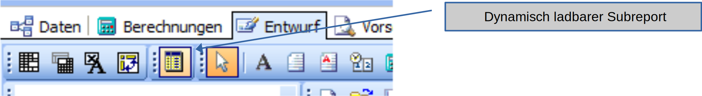

Ziehen Sie nun den Bereich zwischen Titel und Gruppenkopf ein wenig auseinander und klicken mit links hier hinein. Nun müsste der Subreport vorhanden sein:

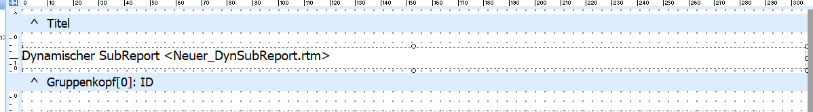

Klicken Sie mit rechts auf den Subreport und dann auf "Subreportdatei wählen". Es öffnet sich ein Windowsfenster im Ordner Header_Footer. Wählen Sie bspw. den Brief_Kopf_Eltern.rtm und klicken auf "öffnen".

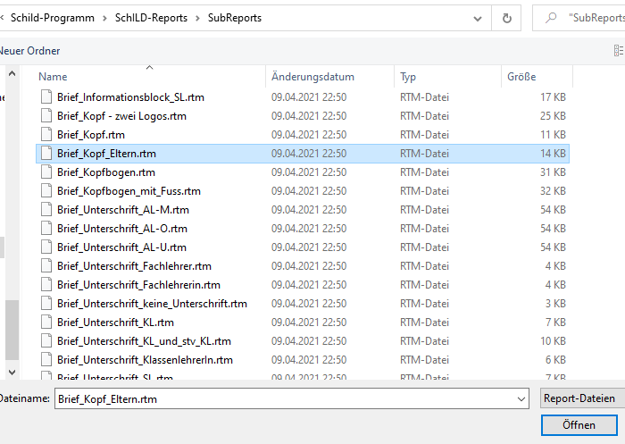

Analog setzten Sie in den Gruppenfuß den Dynamisch ladbaren Subreport Brief-Unterschrift_SL.rtm

### Betreffzeile eingeben und Schönheitsanpassungen

Gehen Sie in den Subreport1:Erzieher in den Detailbereich und klicken mit der rechten Maustaste in einen leeren Bereich. Dort wählen Sie für diesen eine Statische Höhe anstatt der standardmäßig gesetzten dynamischen Höhe. Ziehen Sie den Detailbereich dann etwas größer und platzieren oben Rechts ein Label.  
Merken Sie sich die Nummer des Labels und wechseln in die Programmieransicht. Gehen Sie nun auf Berechnungen und wählen für das Label das Ereignis OnGetText und klicken in den Programmierbereich.

Geben Sie hier nun Mithilfe der Datenquellen (siehe Punkt 7.7 in diesem Dokument) den folgenden Ausdruck ein:

    begin
        Text := 'Betreff: Fehlverhalten ' + Schueler['SohnOderTocherGenitiv'] + ' ' + Schueler['VornameName'] + ', Klasse ' + Schueler['Klasse'];
    end;

Sie können nun noch weiter die Felder passend ziehen und die Schriftgrößen angleichen. Fertig. Ihr Brief sollte nun mit den Abfragen ungefähr so aussehen:

